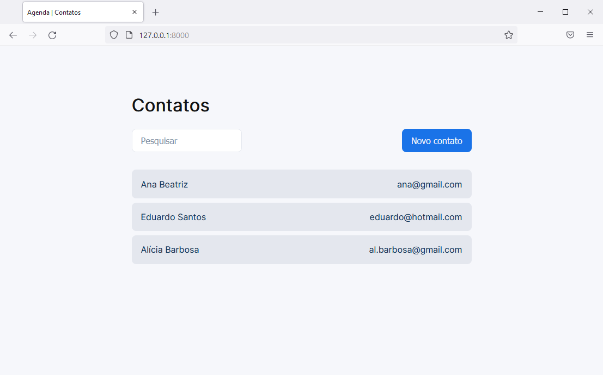

<p align="center">
    
</p>

Agenda é uma aplicação simples em php, html e css com banco de dados em mysql criada utilizando o framework [Laravel](https://laravel.com/).

## Eixos Solicitados (telas)

### Cadastro dos dados pessoais do contato

- [x] Nome
- [x] CPF (único)
- [x] E-mail (único)
- [x] Data de nascimento (correção de formato)

### Cadastro de endereços do contato

- [x] Seletor
- [x] CEP
- [x] Rua
- [x] Número
- [x] Bairro
- [x] Cidade
- [x] Estado (seletor)
- [ ] Edição de dados

### Cadastrar telefones

- [x] Seletor
- [x] Telefone comercial (único)
- [x] Telefone residencial (único)
- [ ] Celular (único e obrigatório)
- [ ] Edição de dados

### Consultar os contatos

- [ ] Busca do tipo ```​%like%```
- [ ] Carregar dados da pesquisa resultante

## Instalação (self-hosted)

### Pré-instalação

#### Instalando o Laravel

> Windows 10

Para gerir as dependêcias instalaremos dois aplicativos [XAMPP](https://www.apachefriends.org/pt_br/index.html) (para o mysql, apache e php) e [Composer](https://getcomposer.org/) (dependências do php).

Certifique-se que a pasta do php está no Path e então basta rodar o seguinte comando.

```bash
composer global require laravel/installer
```

E a instalação está completa.

### Instalação

```bash
git clone https://github.com/mac-carlos/agenda.git

cd agenda

php artisan server
```

> Vá ao local-host ```127.0.0.1:8000``` para ver a aplicação.

## Autor

Feito com ❤️  e muito ☕  por [Carlos Queiroz](https://mac-carlos.github.io/).

## Licença 

Este é um projeto open-source e está sobre a [Licença MIT](LICENSE). 